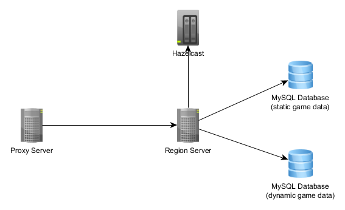

# mmo-gameserver-2.0

Another try to build a mmo game server

 
 
 
 
 
 
 
 

## Gameserver

A gameserver can handle multiple regions.

## Databases

This gameserver uses 2 databases, one for **static** game data, which will only be changed on game updates / patch (e.q. races, game world itself) and one for **all dynamic things**.

  - static database
      * collision data
      * game world information
      * races
  - dynamic database
      * characters
      * dynamic environment (weather and so on)

## Setup

As you can already imagine, it's not as easy to setup the mmo server cluster.\
First a mysql database is required, so you have to create one with a new database user.\
Then copy config/mysql.example.cfg to config/mysql.cfg and insert your mysql access data.\
**Important**! Gameserver requires 2 **different** databases, one for static data (which will be only changed on updates, not when you play) and one for dynamic data (e.q. your current character position).\
\
After that you need a **ftp server**. The gameserver is downloading all region files from ftp server on region startup.\
The basis structure should be as follows:

  - static/regions
      * region_1_1
          * client (all files which are sended to client automatically)
              * i18n
              * maps
              * music
              * **region.json** (region info file - very important for client to find the maps!)
          * server (files which are only intended for gameserver, e.q. server configs, npc scripts and so on)
      * region_1_2
      * and so on

Then copy config/ftp.example.cfg to config/ftp.cfg and insert your ftp access data, so gameserver can download the files.\
\
After that you can start the gameserver, it will automatically creates all required mysql tables.